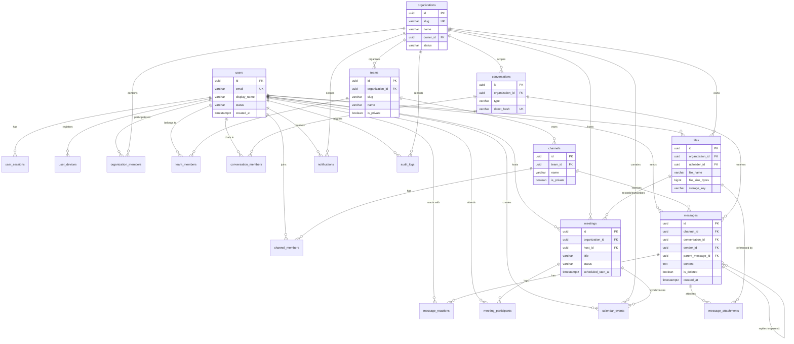

# TeamTrack Database Architecture Specification

> **Phase**: Phase 2 — Database Architecture Planning  
> **Target Database Engine**: PostgreSQL 16+  
> **Status**: Architecture Planned & Approved  
> **Scope**: Structural design, entity relationships, integrity constraints, indexing, and migration strategy. No runtime database connections, ORMs, or premature feature implementations are introduced in this phase.

---

## 1. Core Architecture Principles

### 1.1 PostgreSQL as the Persistent Source of Truth
PostgreSQL serves as the primary, durable source of truth for all TeamTrack state. All application entities, structural hierarchies, access memberships, communication history, and audit trails reside durably within PostgreSQL.

```text
┌─────────────────────────────────────────────────────────┐
│                      Client Tier                        │
│            Web (Next.js) | Desktop | Mobile             │
└────────────────────────────┬────────────────────────────┘
                             │ HTTPS / WSS
                             ▼
┌─────────────────────────────────────────────────────────┐
│                      Backend Tier                       │
│       Node.js + Express API & Realtime Services         │
│          (Sole Client with Database Credentials)        │
└────────────────────────────┬────────────────────────────┘
                             │ Connection Pool (SQL)
                             ▼
┌─────────────────────────────────────────────────────────┐
│                      Database Tier                      │
│             PostgreSQL 16+ (Persistent Store)           │
└─────────────────────────────────────────────────────────┘
```

### 1.2 Backend-Only Database Access
1. **Zero Direct Client Access**: Web, Desktop, and Mobile clients never receive direct database connection credentials or execute arbitrary SQL.
2. **Authority & Enforcement**: The Node.js backend tier owns all database connections, executes queries with prepared statements, enforces business logic, and acts as the sole authority for authentication, authorization, and data validation.
3. **Network Isolation**: In production, the PostgreSQL instance must reside inside an isolated private subnet, accepting connections exclusively from backend application hosts.

### 1.3 ACID Transactions & Concurrency
- **ACID Guarantees**: Multi-step business operations (e.g., creating an organization and assigning initial owner membership; sending a message and inserting attachments) must execute within explicit database transactions (`BEGIN ... COMMIT`).
- **Isolation Level**: Default transaction isolation level is `READ COMMITTED`. Sensitive concurrent operations (e.g., membership transfer, direct conversation deduplication) utilize `REPEATABLE READ` or explicit row-level locking (`SELECT ... FOR UPDATE`).

### 1.4 Connection Pooling Expectations
- PostgreSQL forks a backend process per connection. Connection pooling (e.g., PgBouncer or backend-managed connection pools) is mandatory.
- Application pool size will be tuned according to CPU cores and memory, keeping database connection churn minimal while serving concurrent API traffic.

---

## 2. Standards & Conventions

### 2.1 Primary Key & Identifier Strategy
- **UUIDv4**: All public application entities utilize UUIDv4 generated via PostgreSQL native `gen_random_uuid()` (introduced natively in PostgreSQL 13, optimized in PostgreSQL 16).
- **Rationale**:
  - Prevents sequential ID enumeration attacks and data volume disclosure.
  - Enables safe client-side or distributed ID generation when required in future offline-first mobile scenarios.
  - Eliminates ID collisions across distributed environments.
- **Rule**: Auto-incrementing integer IDs (`SERIAL` / `BIGSERIAL`) are **never** exposed as public entity identifiers.

### 2.2 Timestamp & Timezone Strategy
- **`TIMESTAMPTZ` (Timestamp with Time Zone)**: All timestamps are declared as `TIMESTAMPTZ` with `DEFAULT NOW()`.
- **UTC Standard**: All timestamps are stored in UTC. The database session must operate in `UTC` (`SET timezone = 'UTC'`).
- **Presentation Decoupling**: Timezone offset conversions are strictly the responsibility of the client/presentation layer based on local user preference.
- **Audit Columns**: Every durable entity includes `created_at TIMESTAMPTZ NOT NULL DEFAULT NOW()` and `updated_at TIMESTAMPTZ NOT NULL DEFAULT NOW()`. Soft-deletable entities include `deleted_at TIMESTAMPTZ NULL`.

### 2.3 Naming Conventions
| Element | Convention | Example |
| :--- | :--- | :--- |
| **Tables** | Lowercase, plural, `snake_case` | `users`, `organization_members`, `messages` |
| **Columns** | Lowercase, singular, `snake_case` | `display_name`, `created_at`, `is_archived` |
| **Primary Keys** | Explicitly named `id` of type `UUID` | `id` |
| **Foreign Keys** | Singular referenced table name + `_id` | `user_id`, `organization_id`, `channel_id` |
| **Indexes** | `idx_<table>_<column(s)>` | `idx_messages_channel_created` |
| **Unique Constraints** | `uq_<table>_<column(s)>` | `uq_org_members_org_user` |
| **Check Constraints** | `chk_<table>_<description>` | `chk_messages_target_exclusive` |
| **Foreign Key Constraints** | `fk_<table>_<referenced_table>` | `fk_messages_users` |

---

## 3. Core Entity Design

### 3.1 Domain: Identity

#### 1. `users`
Represents individual accounts across TeamTrack.
- **Primary Key**: `id UUID DEFAULT gen_random_uuid()`
- **Columns**:
  - `email VARCHAR(255) NOT NULL`: Normalized lowercase email address.
  - `display_name VARCHAR(100) NOT NULL`: User handle / visible screen name.
  - `full_name VARCHAR(150) NULL`: Real name or optional profile name.
  - `avatar_url VARCHAR(1024) NULL`: Optional reference to avatar image in object storage.
  - `status VARCHAR(50) NOT NULL DEFAULT 'active'`: Account status (`active`, `suspended`, `deactivated`).
  - `created_at TIMESTAMPTZ NOT NULL DEFAULT NOW()`
  - `updated_at TIMESTAMPTZ NOT NULL DEFAULT NOW()`
  - `deleted_at TIMESTAMPTZ NULL`: Soft-delete timestamp.
- **Constraints**:
  - `uq_users_email UNIQUE (email)`
  - `chk_users_status CHECK (status IN ('active', 'suspended', 'deactivated'))`
- **Security Rule**: Plaintext passwords, authentication hashes, and tokens are **never** stored in the core profile table. Authentication secrets belong to future dedicated credential tables.
- **Deletion Policy**: Soft-delete (`deleted_at = NOW()`, `status = 'deactivated'`). Preserves historical authorship of messages, reactions, and audit trails.

#### 2. `user_sessions`
Tracks active authenticated sessions for web, desktop, and mobile clients.
- **Primary Key**: `id UUID DEFAULT gen_random_uuid()`
- **Columns**:
  - `user_id UUID NOT NULL REFERENCES users(id) ON DELETE CASCADE`
  - `refresh_token_hash VARCHAR(255) NOT NULL`: Cryptographic hash of issued refresh token.
  - `user_agent TEXT NULL`: Client browser/app user-agent string.
  - `ip_address INET NULL`: Client IP address for security auditing.
  - `expires_at TIMESTAMPTZ NOT NULL`: Absolute token expiration.
  - `created_at TIMESTAMPTZ NOT NULL DEFAULT NOW()`
  - `revoked_at TIMESTAMPTZ NULL`: Explicit logout / revocation timestamp.
- **Constraints**:
  - `uq_user_sessions_token_hash UNIQUE (refresh_token_hash)`
- **Indexes**:
  - `idx_user_sessions_lookup (user_id, revoked_at, expires_at)`
- **Deletion Policy**: Hard delete of expired sessions via periodic cleanup jobs; immediate soft-invalidation via `revoked_at`.

#### 3. `user_devices`
Tracks registered physical devices for mobile/desktop push notifications.
- **Primary Key**: `id UUID DEFAULT gen_random_uuid()`
- **Columns**:
  - `user_id UUID NOT NULL REFERENCES users(id) ON DELETE CASCADE`
  - `device_token VARCHAR(512) NOT NULL`: APNs / FCM registration token.
  - `platform VARCHAR(30) NOT NULL`: Client OS (`ios`, `android`, `windows`, `macos`, `linux`, `web`).
  - `device_model VARCHAR(100) NULL`: Hardware model string.
  - `app_version VARCHAR(50) NULL`: Running application build version.
  - `is_active BOOLEAN NOT NULL DEFAULT true`: Whether token is currently valid.
  - `last_seen_at TIMESTAMPTZ NOT NULL DEFAULT NOW()`
  - `created_at TIMESTAMPTZ NOT NULL DEFAULT NOW()`
- **Constraints**:
  - `uq_user_devices_token UNIQUE (device_token)`
  - `chk_user_devices_platform CHECK (platform IN ('ios', 'android', 'windows', 'macos', 'linux', 'web'))`
- **Indexes**:
  - `idx_user_devices_user (user_id, is_active)`

---

### 3.2 Domain: Organization

#### 4. `organizations`
Top-level multi-tenant container for teams, channels, conversations, and files.
- **Primary Key**: `id UUID DEFAULT gen_random_uuid()`
- **Columns**:
  - `name VARCHAR(150) NOT NULL`: Organization display name.
  - `slug VARCHAR(80) NOT NULL`: Unique URL-friendly slug (e.g. `acme-corp`).
  - `owner_id UUID NOT NULL REFERENCES users(id) ON DELETE RESTRICT`: Organization creator/owner.
  - `status VARCHAR(50) NOT NULL DEFAULT 'active'`: (`active`, `archived`, `suspended`).
  - `created_at TIMESTAMPTZ NOT NULL DEFAULT NOW()`
  - `updated_at TIMESTAMPTZ NOT NULL DEFAULT NOW()`
  - `deleted_at TIMESTAMPTZ NULL`: Soft-delete/archival timestamp.
- **Constraints**:
  - `uq_organizations_slug UNIQUE (slug)`
  - `chk_organizations_status CHECK (status IN ('active', 'archived', 'suspended'))`
- **Deletion Policy**: Soft-delete via `deleted_at`. Foreign key `ON DELETE RESTRICT` on `owner_id` prevents deleting an owner account while an organization exists.

#### 5. `organization_members`
Connects users to organizations with extensible role assignments.
- **Primary Key**: `id UUID DEFAULT gen_random_uuid()`
- **Columns**:
  - `organization_id UUID NOT NULL REFERENCES organizations(id) ON DELETE CASCADE`
  - `user_id UUID NOT NULL REFERENCES users(id) ON DELETE RESTRICT`
  - `role VARCHAR(50) NOT NULL DEFAULT 'member'`: (`owner`, `admin`, `member`, `guest`).
  - `status VARCHAR(50) NOT NULL DEFAULT 'active'`: (`active`, `invited`, `suspended`).
  - `joined_at TIMESTAMPTZ NOT NULL DEFAULT NOW()`
  - `updated_at TIMESTAMPTZ NOT NULL DEFAULT NOW()`
- **Constraints**:
  - `uq_org_members_org_user UNIQUE (organization_id, user_id)`: **Guarantees no duplicate memberships**.
  - `chk_org_members_role CHECK (role IN ('owner', 'admin', 'member', 'guest'))`
  - `chk_org_members_status CHECK (status IN ('active', 'invited', 'suspended'))`
- **Indexes**:
  - `idx_org_members_user (user_id)`: Rapid lookup of all organizations a user belongs to.

---

### 3.3 Domain: Team & Channel

#### 6. `teams`
Functional groups within an organization (e.g., Engineering, Marketing).
- **Primary Key**: `id UUID DEFAULT gen_random_uuid()`
- **Columns**:
  - `organization_id UUID NOT NULL REFERENCES organizations(id) ON DELETE CASCADE`
  - `name VARCHAR(100) NOT NULL`: Team name.
  - `slug VARCHAR(80) NOT NULL`: URL-friendly slug unique within the organization.
  - `description TEXT NULL`
  - `is_private BOOLEAN NOT NULL DEFAULT false`: Private vs public team visibility.
  - `is_archived BOOLEAN NOT NULL DEFAULT false`
  - `created_at TIMESTAMPTZ NOT NULL DEFAULT NOW()`
  - `updated_at TIMESTAMPTZ NOT NULL DEFAULT NOW()`
  - `deleted_at TIMESTAMPTZ NULL`
- **Constraints**:
  - `uq_teams_org_slug UNIQUE (organization_id, slug)`
- **Indexes**:
  - `idx_teams_org (organization_id)` WHERE `deleted_at IS NULL`

#### 7. `team_members`
Membership junction between users and teams.
- **Primary Key**: `id UUID DEFAULT gen_random_uuid()`
- **Columns**:
  - `team_id UUID NOT NULL REFERENCES teams(id) ON DELETE CASCADE`
  - `user_id UUID NOT NULL REFERENCES users(id) ON DELETE RESTRICT`
  - `role VARCHAR(50) NOT NULL DEFAULT 'member'`: (`lead`, `member`).
  - `joined_at TIMESTAMPTZ NOT NULL DEFAULT NOW()`
- **Constraints**:
  - `uq_team_members_team_user UNIQUE (team_id, user_id)`: **Guarantees no duplicate team memberships**.
  - `chk_team_members_role CHECK (role IN ('lead', 'member'))`
- **Indexes**:
  - `idx_team_members_user (user_id)`

#### 8. `channels`
Topic-based communication channels inside teams.
- **Primary Key**: `id UUID DEFAULT gen_random_uuid()`
- **Columns**:
  - `team_id UUID NOT NULL REFERENCES teams(id) ON DELETE CASCADE`
  - `name VARCHAR(80) NOT NULL`: Channel name (e.g. `general`, `deployments`).
  - `description TEXT NULL`
  - `is_private BOOLEAN NOT NULL DEFAULT false`: Private channel restriction.
  - `is_archived BOOLEAN NOT NULL DEFAULT false`: Read-only historical channel state.
  - `created_at TIMESTAMPTZ NOT NULL DEFAULT NOW()`
  - `updated_at TIMESTAMPTZ NOT NULL DEFAULT NOW()`
  - `deleted_at TIMESTAMPTZ NULL`
- **Constraints**:
  - `uq_channels_team_name UNIQUE (team_id, name)`: Unique channel name per team.
- **Indexes**:
  - `idx_channels_team (team_id)` WHERE `deleted_at IS NULL`

#### 9. `channel_members`
Explicit memberships for private channels.
- **Primary Key**: `id UUID DEFAULT gen_random_uuid()`
- **Columns**:
  - `channel_id UUID NOT NULL REFERENCES channels(id) ON DELETE CASCADE`
  - `user_id UUID NOT NULL REFERENCES users(id) ON DELETE RESTRICT`
  - `role VARCHAR(50) NOT NULL DEFAULT 'member'`: (`admin`, `member`).
  - `joined_at TIMESTAMPTZ NOT NULL DEFAULT NOW()`
- **Constraints**:
  - `uq_channel_members_channel_user UNIQUE (channel_id, user_id)`: **Guarantees no duplicate channel memberships**.

---

### 3.4 Domain: Communication (Conversations & Messages)

#### 10. `conversations`
Direct messages (1-to-1) and ad-hoc group messages outside team channels.
- **Primary Key**: `id UUID DEFAULT gen_random_uuid()`
- **Columns**:
  - `organization_id UUID NOT NULL REFERENCES organizations(id) ON DELETE CASCADE`
  - `type VARCHAR(20) NOT NULL`: (`direct`, `group`).
  - `direct_hash VARCHAR(64) NULL`: Deterministic hash of participants for direct messages (e.g., SHA256 of sorted participant IDs `min(user_a, user_b):max(user_a, user_b)`).
  - `title VARCHAR(150) NULL`: Optional custom title for group conversations.
  - `is_archived BOOLEAN NOT NULL DEFAULT false`
  - `created_at TIMESTAMPTZ NOT NULL DEFAULT NOW()`
  - `updated_at TIMESTAMPTZ NOT NULL DEFAULT NOW()`
- **Constraints**:
  - `chk_conversations_type CHECK (type IN ('direct', 'group'))`
  - `uq_conversations_direct_hash UNIQUE (organization_id, direct_hash)`: **Prevents duplicate 1-to-1 direct conversations between the same pair of users in an organization**.

#### 11. `conversation_members`
Participants in direct or group conversations.
- **Primary Key**: `id UUID DEFAULT gen_random_uuid()`
- **Columns**:
  - `conversation_id UUID NOT NULL REFERENCES conversations(id) ON DELETE CASCADE`
  - `user_id UUID NOT NULL REFERENCES users(id) ON DELETE RESTRICT`
  - `joined_at TIMESTAMPTZ NOT NULL DEFAULT NOW()`
  - `last_read_at TIMESTAMPTZ NOT NULL DEFAULT NOW()`: Cursor tracking message read receipts.
- **Constraints**:
  - `uq_conv_members_conv_user UNIQUE (conversation_id, user_id)`: **Guarantees no duplicate conversation memberships**.
- **Indexes**:
  - `idx_conv_members_user (user_id, last_read_at)`

#### 12. `messages`
Durable messages posted to channels or conversations.
- **Primary Key**: `id UUID DEFAULT gen_random_uuid()`
- **Columns**:
  - `channel_id UUID NULL REFERENCES channels(id) ON DELETE RESTRICT`
  - `conversation_id UUID NULL REFERENCES conversations(id) ON DELETE RESTRICT`
  - `sender_id UUID NOT NULL REFERENCES users(id) ON DELETE RESTRICT`
  - `parent_message_id UUID NULL REFERENCES messages(id) ON DELETE SET NULL`: Reply/thread parent reference.
  - `content TEXT NOT NULL`: Message markdown/text body.
  - `content_type VARCHAR(50) NOT NULL DEFAULT 'text/plain'`: (`text/plain`, `text/markdown`, `system`).
  - `is_edited BOOLEAN NOT NULL DEFAULT false`
  - `is_deleted BOOLEAN NOT NULL DEFAULT false`: Tombstone flag.
  - `created_at TIMESTAMPTZ NOT NULL DEFAULT NOW()`
  - `updated_at TIMESTAMPTZ NOT NULL DEFAULT NOW()`
  - `deleted_at TIMESTAMPTZ NULL`
- **Target Exclusivity Constraint**:
  ```sql
  CONSTRAINT chk_messages_target_exclusive CHECK (
    (channel_id IS NOT NULL AND conversation_id IS NULL) OR
    (channel_id IS NULL AND conversation_id IS NOT NULL)
  )
  ```
  **Rule**: Every message belongs to **exactly one** delivery target: either a channel OR a conversation.
- **Threading Separation**: Replies reference `parent_message_id`. Threading is independent of delivery target; thread replies inherit the same `channel_id` or `conversation_id`.
- **Indexes for High-Volume Chronological Querying**:
  - `idx_messages_channel_feed (channel_id, created_at DESC) WHERE is_deleted = false`
  - `idx_messages_conv_feed (conversation_id, created_at DESC) WHERE is_deleted = false`
  - `idx_messages_thread (parent_message_id, created_at ASC) WHERE parent_message_id IS NOT NULL`
- **Deletion Policy**: Soft-delete (`is_deleted = true`, `deleted_at = NOW()`). Foreign keys on `channel_id`, `conversation_id`, and `sender_id` use `ON DELETE RESTRICT` to preserve communication records.

#### 13. `message_reactions`
Emoji/unicode reactions attached to messages.
- **Primary Key**: `id UUID DEFAULT gen_random_uuid()`
- **Columns**:
  - `message_id UUID NOT NULL REFERENCES messages(id) ON DELETE CASCADE`
  - `user_id UUID NOT NULL REFERENCES users(id) ON DELETE RESTRICT`
  - `reaction_code VARCHAR(64) NOT NULL`: Unicode character or standardized shortcode (e.g. `+1`, `heart`).
  - `created_at TIMESTAMPTZ NOT NULL DEFAULT NOW()`
- **Constraints**:
  - `uq_reactions_msg_user_code UNIQUE (message_id, user_id, reaction_code)`: A user cannot react with the same emoji twice on the same message.
- **Indexes**:
  - `idx_reactions_message (message_id)`

#### 14. `message_attachments`
Junction mapping files attached to messages.
- **Primary Key**: `id UUID DEFAULT gen_random_uuid()`
- **Columns**:
  - `message_id UUID NOT NULL REFERENCES messages(id) ON DELETE CASCADE`
  - `file_id UUID NOT NULL REFERENCES files(id) ON DELETE RESTRICT`
  - `created_at TIMESTAMPTZ NOT NULL DEFAULT NOW()`
- **Constraints**:
  - `uq_attachments_msg_file UNIQUE (message_id, file_id)`
- **Indexes**:
  - `idx_attachments_file (file_id)`

---

### 3.5 Domain: Meetings

#### 15. `meetings`
Scheduled, active, or concluded video/audio meeting sessions.
- **Primary Key**: `id UUID DEFAULT gen_random_uuid()`
- **Columns**:
  - `organization_id UUID NOT NULL REFERENCES organizations(id) ON DELETE CASCADE`
  - `host_id UUID NOT NULL REFERENCES users(id) ON DELETE RESTRICT`
  - `title VARCHAR(200) NOT NULL`: Meeting title.
  - `description TEXT NULL`
  - `scheduled_start_at TIMESTAMPTZ NOT NULL`: Scheduled time slot.
  - `scheduled_end_at TIMESTAMPTZ NULL`: Optional calendar end slot.
  - `actual_start_at TIMESTAMPTZ NULL`: Timestamp meeting went live.
  - `actual_end_at TIMESTAMPTZ NULL`: Timestamp meeting concluded.
  - `status VARCHAR(30) NOT NULL DEFAULT 'scheduled'`: (`scheduled`, `active`, `ended`, `cancelled`).
  - `recording_file_id UUID NULL REFERENCES files(id) ON DELETE SET NULL`: Optional recording file metadata reference.
  - `transcription_file_id UUID NULL REFERENCES files(id) ON DELETE SET NULL`: Optional transcript metadata reference.
  - `created_at TIMESTAMPTZ NOT NULL DEFAULT NOW()`
  - `updated_at TIMESTAMPTZ NOT NULL DEFAULT NOW()`
- **Duration Architectural Rule**:
  > **CRITICAL**: There is **no database-level or schema-enforced 1-hour meeting duration limit**. Meetings may remain `active` indefinitely until explicitly ended by the host or backend signaling service.
- **Constraints**:
  - `chk_meetings_status CHECK (status IN ('scheduled', 'active', 'ended', 'cancelled'))`
- **Indexes**:
  - `idx_meetings_org_status (organization_id, status, scheduled_start_at)`
  - `idx_meetings_host (host_id, created_at DESC)`

#### 16. `meeting_participants`
Historical participant log tracking attendee presence in meetings.
- **Primary Key**: `id UUID DEFAULT gen_random_uuid()`
- **Columns**:
  - `meeting_id UUID NOT NULL REFERENCES meetings(id) ON DELETE CASCADE`
  - `user_id UUID NOT NULL REFERENCES users(id) ON DELETE RESTRICT`
  - `role VARCHAR(50) NOT NULL DEFAULT 'attendee'`: (`host`, `presenter`, `attendee`).
  - `joined_at TIMESTAMPTZ NOT NULL DEFAULT NOW()`
  - `left_at TIMESTAMPTZ NULL`
  - `connection_status VARCHAR(30) NOT NULL DEFAULT 'connected'`: (`connected`, `reconnecting`, `disconnected`).
- **Constraints**:
  - `uq_meeting_participants_session UNIQUE (meeting_id, user_id, joined_at)`
  - `chk_meeting_part_role CHECK (role IN ('host', 'presenter', 'attendee'))`
- **Indexes**:
  - `idx_meeting_part_meeting (meeting_id, user_id)`

---

### 3.6 Domain: Files & Storage Metadata

#### 17. `files`
Stores file **metadata only**. Binary objects are stored exclusively in object storage (AWS S3, MinIO, Google Cloud Storage).
- **Primary Key**: `id UUID DEFAULT gen_random_uuid()`
- **Columns**:
  - `organization_id UUID NOT NULL REFERENCES organizations(id) ON DELETE CASCADE`
  - `uploader_id UUID NOT NULL REFERENCES users(id) ON DELETE RESTRICT`
  - `file_name VARCHAR(255) NOT NULL`: Sanitized original filename.
  - `file_size_bytes BIGINT NOT NULL`: Size in bytes.
  - `mime_type VARCHAR(127) NOT NULL`: Standard IANA MIME type.
  - `storage_driver VARCHAR(50) NOT NULL DEFAULT 's3'`: (`s3`, `local`, `gcs`).
  - `storage_key VARCHAR(1024) NOT NULL`: Object storage URI / key path.
  - `checksum_sha256 VARCHAR(64) NULL`: Cryptographic hash for deduplication and integrity validation.
  - `is_deleted BOOLEAN NOT NULL DEFAULT false`
  - `created_at TIMESTAMPTZ NOT NULL DEFAULT NOW()`
  - `deleted_at TIMESTAMPTZ NULL`
- **Binary Separation Principle**:
  ```text
  PostgreSQL: Stores metadata (file_name, size, mime_type, storage_key, uploader_id)
  Object Storage: Stores actual binary data at storage_key (e.g. s3://teamtrack-uploads/org_id/...)
  ```
- **Constraints**:
  - `chk_files_size_positive CHECK (file_size_bytes >= 0)`
- **Indexes**:
  - `idx_files_org (organization_id, created_at DESC) WHERE is_deleted = false`
  - `idx_files_checksum (organization_id, checksum_sha256) WHERE checksum_sha256 IS NOT NULL`

---

### 3.7 Domain: Calendar

#### 18. `calendar_events`
Organization calendar events, meeting syncs, and deadlines.
- **Primary Key**: `id UUID DEFAULT gen_random_uuid()`
- **Columns**:
  - `organization_id UUID NOT NULL REFERENCES organizations(id) ON DELETE CASCADE`
  - `creator_id UUID NOT NULL REFERENCES users(id) ON DELETE RESTRICT`
  - `meeting_id UUID NULL REFERENCES meetings(id) ON DELETE SET NULL`: Optional linked TeamTrack meeting.
  - `title VARCHAR(200) NOT NULL`
  - `description TEXT NULL`
  - `start_time TIMESTAMPTZ NOT NULL`
  - `end_time TIMESTAMPTZ NOT NULL`
  - `timezone VARCHAR(50) NOT NULL DEFAULT 'UTC'`: Timezone preference context for recurring schedules.
  - `location VARCHAR(255) NULL`
  - `recurrence_rule TEXT NULL`: Standard iCalendar RFC 5545 RRULE string.
  - `is_cancelled BOOLEAN NOT NULL DEFAULT false`
  - `created_at TIMESTAMPTZ NOT NULL DEFAULT NOW()`
  - `updated_at TIMESTAMPTZ NOT NULL DEFAULT NOW()`
- **Constraints**:
  - `chk_calendar_event_chronology CHECK (end_time > start_time)`
- **Indexes**:
  - `idx_calendar_org_time (organization_id, start_time, end_time) WHERE is_cancelled = false`

---

### 3.8 Domain: Notifications

#### 19. `notifications`
User alert inbox for message mentions, meeting invites, and organization notices.
- **Primary Key**: `id UUID DEFAULT gen_random_uuid()`
- **Columns**:
  - `recipient_id UUID NOT NULL REFERENCES users(id) ON DELETE CASCADE`
  - `organization_id UUID NULL REFERENCES organizations(id) ON DELETE CASCADE`
  - `type VARCHAR(50) NOT NULL`: (`mention`, `direct_message`, `meeting_invite`, `team_invite`, `system`).
  - `title VARCHAR(200) NOT NULL`
  - `body TEXT NOT NULL`
  - `data_payload JSONB NOT NULL DEFAULT '{}'::jsonb`: Metadata containing entity references (`channel_id`, `message_id`, `meeting_id`).
  - `is_read BOOLEAN NOT NULL DEFAULT false`
  - `read_at TIMESTAMPTZ NULL`
  - `created_at TIMESTAMPTZ NOT NULL DEFAULT NOW()`
- **Indexes for High-Volume Inbox Fetching**:
  - `idx_notifications_unread (recipient_id, created_at DESC) WHERE is_read = false`: **Optimized for badge counts and unread tray**.
  - `idx_notifications_recipient_all (recipient_id, created_at DESC)`

---

### 3.9 Domain: Auditing

#### 20. `audit_logs`
Append-only, immutable audit trail of security and governance events.
- **Primary Key**: `id UUID DEFAULT gen_random_uuid()`
- **Columns**:
  - `organization_id UUID NULL REFERENCES organizations(id) ON DELETE SET NULL`
  - `actor_id UUID NULL REFERENCES users(id) ON DELETE SET NULL`: User who performed action.
  - `action VARCHAR(100) NOT NULL`: (`user.login`, `member.invite`, `channel.create`, `role.update`, `meeting.end`).
  - `entity_type VARCHAR(50) NOT NULL`: (`user`, `organization`, `team`, `channel`, `message`, `meeting`).
  - `entity_id UUID NOT NULL`: Identifier of target entity.
  - `ip_address INET NULL`: Client IP address.
  - `user_agent TEXT NULL`
  - `metadata JSONB NOT NULL DEFAULT '{}'::jsonb`: Diff or context parameters.
  - `created_at TIMESTAMPTZ NOT NULL DEFAULT NOW()`
- **Security Rule**: Audit log records are **strictly append-only**. Update and delete privileges are revoked in production. `metadata` must **never** record passwords, JWT tokens, private keys, or credentials.
- **Indexes**:
  - `idx_audit_logs_org_created (organization_id, created_at DESC)`
  - `idx_audit_logs_entity (entity_type, entity_id, created_at DESC)`

---

## 4. Entity Relationship Diagram (ERD)



---

## 5. Indexing Strategy & High-Volume Query Optimization

| Table | Index Columns | Index Type | Query Purpose & Optimization |
| :--- | :--- | :--- | :--- |
| `messages` | `(channel_id, created_at DESC) WHERE is_deleted = false` | B-tree (Partial) | Powers high-frequency channel chat streams with pagination (`WHERE created_at < $cursor LIMIT 50`). |
| `messages` | `(conversation_id, created_at DESC) WHERE is_deleted = false` | B-tree (Partial) | Powers direct and group conversation message history. |
| `messages` | `(parent_message_id, created_at ASC) WHERE parent_message_id IS NOT NULL` | B-tree (Partial) | Powers message reply thread rendering in chronological order. |
| `notifications` | `(recipient_id, created_at DESC) WHERE is_read = false` | B-tree (Partial) | Ultra-fast badge count calculation and unread notification tray queries without scanning read rows. |
| `notifications` | `(recipient_id, created_at DESC)` | B-tree | Standard paginated notification inbox list. |
| `organization_members` | `(user_id)` | B-tree | Fast tenant workspace resolution when a user logs in. |
| `team_members` | `(user_id)` | B-tree | Fast retrieval of all teams a user belongs to. |
| `conversation_members`| `(user_id, last_read_at)` | B-tree | Enables client conversation list ordering by active unread state. |
| `user_sessions` | `(user_id, revoked_at, expires_at)` | B-tree | Rapid authentication token verification on incoming API requests. |
| `meeting_participants`| `(meeting_id, user_id)` | B-tree | Attendee list rendering and meeting authorization verification. |
| `audit_logs` | `(organization_id, created_at DESC)` | B-tree | Security audit viewer filtering by tenant chronologically. |
| `audit_logs` | `(entity_type, entity_id, created_at DESC)` | B-tree | Resource-specific audit trail inspection (e.g. channel history). |
| `files` | `(organization_id, checksum_sha256)` | B-tree (Partial) | Content-addressable deduplication check prior to uploading large files. |

---

## 6. Foreign Key & Deletion Policies

Careless blanket usage of `ON DELETE CASCADE` destroys critical audit trails, historical communication, and corporate compliance records. TeamTrack enforces three distinct foreign key deletion tiers:

### 6.1 Cascade Tier (`ON DELETE CASCADE`)
Used strictly for **pure ownership children** that have no independent meaning if the parent container is permanently destroyed:
- Deleting a `session` or `device` when a user account is purged.
- Deleting `message_reactions` and `message_attachments` when a message record is purged.
- Deleting `teams`, `conversations`, and `meetings` when an entire `organization` tenant is purged.

### 6.2 Restrict Tier (`ON DELETE RESTRICT`)
Mandatory for **historical authorship and integrity preservation**:
- `messages.sender_id`: When a user leaves an organization or deactivates their account, their past messages **must remain visible** with an appropriate "Deactivated User" tag. Deleting a user row with active messages is blocked (`RESTRICT`).
- `files.uploader_id`: Files remain associated with the organization even if the uploader departs.
- `organizations.owner_id`: Prevents deleting a user who is the sole active owner of an organization. Ownership must be transferred first.
- `messages.channel_id` and `messages.conversation_id`: Channels/conversations containing historical messages cannot be hard-deleted casually; they must be archived or soft-deleted.

### 6.3 Set Null Tier (`ON DELETE SET NULL`)
Used for **optional relationships and reference lookups**:
- `messages.parent_message_id`: If a parent thread message is purged, replies remain intact with `parent_message_id = NULL`.
- `meetings.recording_file_id` and `meetings.transcription_file_id`: If a recording file is deleted from storage, the meeting record is retained.
- `audit_logs.actor_id` and `audit_logs.organization_id`: Audit logs are permanent records; if an actor or tenant is deleted, the log is retained with `actor_id = NULL` while `metadata` preserves the snapshot ID.

---

## 7. Migration & Evolution Strategy

### 7.1 Migration Tooling Principles
- **No Manual DDL in Production**: All production schema changes must execute through version-controlled, automated migrations.
- **Pure SQL Preferred**: Migrations are authored in pure, readable PostgreSQL SQL scripts. No hidden abstractions.
- **Idempotence & Safety**: Every migration must be transactional (`BEGIN ... COMMIT`). If any statement fails, the entire migration rolls back cleanly.

### 7.2 File Organization
All migrations are stored in [database/migrations/](file:///c:/Users/anime/.gemini/antigravity-ide/scratch/TeamTrack/database/migrations):
```text
database/
├── migrations/
│   ├── 20260910000001_create_identity_tables.sql
│   ├── 20260910000002_create_organization_tables.sql
│   ├── 20260910000003_create_communication_tables.sql
│   └── 20260910000004_create_meetings_and_files.sql
├── seeds/
│   └── 01_development_seed.sql
└── README.md
```

### 7.3 Zero-Downtime Migration Rules
When evolving the schema under live traffic in future phases:
1. **Never rename columns in-place**: Use the expand-contract pattern (add new column -> dual-write in backend -> backfill -> switch read -> drop old column).
2. **Never add non-nullable columns without defaults**: Adding `NOT NULL` without a default locks the table for full table rewrites. Always add column with default, or populate first.
3. **Use `CONCURRENTLY` for index creation**: On large production tables, indexes must be created using `CREATE INDEX CONCURRENTLY` outside explicit transaction blocks to prevent table write locks.

---

## 8. Summary of Architectural Decisions Requiring Approval

1. **Direct Message 1:1 Deduplication**:
   - *Decision*: Enforce unique `(organization_id, direct_hash)` on `conversations` where `type = 'direct'`.
   - *Advantage*: Prevents duplicate private message threads between the same two users.
2. **Message Target Exclusivity**:
   - *Decision*: Enforce database check constraint `chk_messages_target_exclusive` ensuring a message is either in a channel or a conversation, never both, never neither.
3. **Meeting Duration Limit Exemption**:
   - *Decision*: Explicitly rejecting arbitrary 1-hour limits; meetings persist in `active` state until an explicit `actual_end_at` signal is recorded.
4. **Binary Storage Decoupling**:
   - *Decision*: Storing zero binary data in PostgreSQL. `files` holds only metadata (`storage_key`, `mime_type`, `checksum_sha256`), pointing to object storage.
5. **Soft Deletion & Historical Authorship**:
   - *Decision*: Hard deletes are barred for messages and users; soft-deletions and tombstoning protect chat logs and compliance audits.
